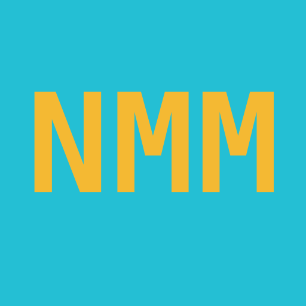

<!-- <div align="center">
  
</div> -->

<br/>

<div align="center">
  
</div>

<h1 align="center">NoMansManager</h1>

<p align="center">
  <strong>A simple cross-platform No Man's Sky mod and base manager</strong>
</p>

<p align="center">
  <a href="#features">Features</a> •
  <a href="#cross-platform">Cross-platform</a> •
  <a href="#getting-started">Getting Started</a> •
  <a href="#tech-stack">Tech Stack</a> •
  <a href="#license">License</a>
</p>

---

## Features

- **Automatic game detection** — Checks your Steam libraries for No Man's Sky. If it can't find it, a startup dialog (or Settings → Game) lets you pick the folder yourself.
- **Add mods** — Drop `.pak` files, folders, or `.zip` archives onto the window, or use **Add files / Add folder**. Bulk add supported — zip contents are auto-detected (even zips containing a single `.pak` or folder) and duplicates are skipped.
- **Import existing mods** — Pulls in anything already in `GAMEDATA/MODS` with one click (**Import** → Copy or Move).
- **Enable / disable & reorder** — Click to select (`Ctrl`/`Cmd` to add, `Shift` for range, click empty space or `Esc` to clear), double-click to toggle, drag with the placement line to reorder, or use **Auto** to sort by type and name. Bottom in list wins when mods overlap.
- **Profiles** — Keep separate mod sets for different saves. Create, duplicate, rename, delete, and switch on the Profiles page.
- **Bases** — Extract Corvette, freighter, and planetary bases from your saves, edit them in Base Builder, and inject them back (with automatic backups). See the Bases page.
- **Customization** — Change theme (Default, Rose Pine, Rose Pine Moon/Dawn, Catppuccin Mocha/Macchiato/Frappe/Latte) and font (Inter, Geist, Space Grotesk, etc.) in Settings. Applies instantly.

---

## Cross-platform

Available for **Windows**, **Linux**, and **macOS**.

---

## Getting Started

### Prerequisites

- Windows, Linux, or macOS
- [Bun](https://bun.sh/) and [Rust](https://www.rust-lang.org/) (source builds only)

Linux source builds also need the Tauri system dependencies:

```bash
sudo apt-get install -y \
  libwebkit2gtk-4.1-dev \
  libappindicator3-dev \
  librsvg2-dev \
  patchelf
```

### Installation

1. Download the latest installer for your platform from [Releases](https://github.com/TheGloved1/NoMansManager/releases) or [Downloads](https://gloved.dev/nomansmanager/download)
2. Run the installer
3. Launch NoMansManager — if your game isn't found automatically, pick your `No Man's Sky` folder when prompted

### Building from Source

```bash
bun install
bun run sync-version
bun tauri build
```

Requires [Bun](https://bun.sh/) and [Rust](https://www.rust-lang.org/).

No `.env` file is needed to build or run the app. Release signing uses the
`TAURI_SIGNING_PRIVATE_KEY` environment variable (provided as a GitHub Secret
in CI, or a local env var for manual builds) — it is never committed.

---

## Privacy & Security

- NoMansManager works fully offline except for the update check against GitHub Releases.
- It reads/writes only: your No Man's Sky `GAMEDATA/MODS` folder, your save
  directories, and its own app data/backups/logs. It never scans unrelated files.
- File access goes through the Rust backend with path validation; the frontend
  has no direct filesystem access (see `src-tauri/capabilities/default.json`).
  The app CSP is disabled (`tauri.conf.json`) because the SvelteKit frontend is
  fully local with no remote content — there is no inline remote script surface.
- Found a vulnerability? Please open a private security advisory or issue at
  [Issues](https://github.com/TheGloved1/NoMansManager/issues) instead of a public PR.

---

## Tech Stack

| Layer             | Technology                                      |
| ----------------- | ----------------------------------------------- |
| Desktop Framework | [Tauri](https://v2.tauri.app/) (Rust backend)   |
| Frontend          | SvelteKit + Svelte 5 + TypeScript               |
| UI Components     | [shadcn-svelte](https://www.shadcn-svelte.com/) |
| Styling           | Tailwind CSS v4                                 |
| State             | Tauri Store plugin + Svelte stores              |
| Build Tool        | Vite                                            |
| Package Manager   | Bun                                             |
| License           | MIT                                             |

---

## License

- [MIT](LICENSE) — NoMansManager is free and open-source software
